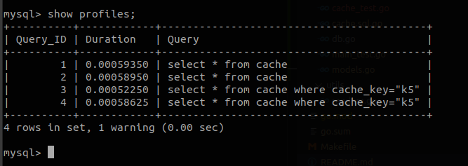
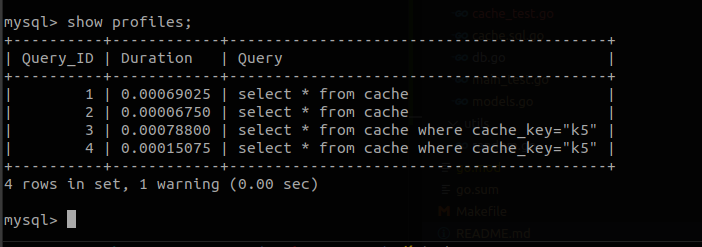

## Using postgres as a cache


## steps to run
* `make postgres`
* `make migrate`
* `make sqlc`
* test `go test ./db/sqlc`
* benchmark `go test -bench=. -benchtime 2000x ./db/sqlc`


## Without query cache



## With query cache



```
show variables like 'query_cache_%' ;
create database cache;
use cache;
CREATE TABLE cache (
    cache_key varchar(10) primary key,
    value varchar(10) not null,
    ttl int default -2
);
insert into cache (cache_key, value) values ("k1", "v1");
insert into cache (cache_key, value) values ("k2", "v2");
insert into cache (cache_key, value) values ("k3", "v3");
insert into cache (cache_key, value) values ("k4", "v4");
insert into cache (cache_key, value) values ("k5", "v5");
insert into cache (cache_key, value) values ("k6", "v6");
insert into cache (cache_key, value) values ("k7", "v7");
insert into cache (cache_key, value) values ("k8", "v8");
insert into cache (cache_key, value) values ("k9", "v9");


SET profiling = 1;

select * from cache;
select * from cache where cache_key="k5";
SHOW PROFILES;
```